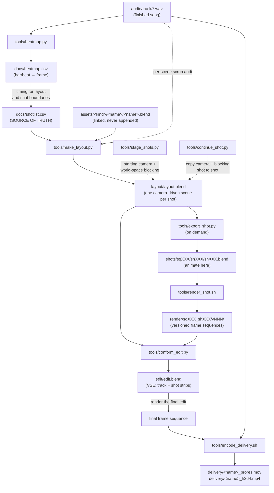

# Pipeline tools & production flow

What each script in `tools/` does, what it reads and writes, and how the whole
thing runs from a finished song to a delivered video. Conventions (naming,
statuses, linking rules) live in `pipeline.md`; the layout invariants and the
drawing-guide workflow live in `layout.md`; this doc is the narrative.

## The big picture

The pipeline is built around one file: **`docs/shotlist.csv`**. Every shot in
the video is a row — its sequence/shot number, description, start/end frame in
the song's timeline, the assets it needs, and a status that walks from
`boarded` to `final`. Humans edit it; every tool reads it. Nothing downstream
invents structure: the tools just materialize what the shotlist says.

Two conventions make the math trivial everywhere:

- **Timeline frame 1 = song time 0, at 24 fps.** Shot frame ranges are
  *song-global* — shot `sq020_sh030` covering frames 481–528 is literally
  seconds 20–22 of the track. Any layout scene or render drops into the edit
  at its own frame numbers and is automatically in sync.
- **Settings live in one place.** Resolution, fps, color management, and
  output format are all applied through `tools/layoutlib.py`'s
  `apply_project_settings()` — `make_template.py` and `make_layout.py` both
  call it, so they cannot independently drift the way they once did (layout
  scenes pass `view_transform="Standard"` since they show greybox blocking
  and flat GP ink, which AgX only muddies; everything else stays AgX).



## The tools, one by one

### `tools/shotlib.py` — the shared brain (not run directly)

A stdlib-only Python module the other tools import. It owns the project's
path math and data contracts so they exist in exactly one place:

- parses and *validates* `docs/shotlist.csv` (3-digit ids, sane frame ranges,
  duration consistency, known statuses, no duplicate shots, and every
  `assets` entry is a known guide name from `guides.py` — bad rows fail
  loudly with `file:line` errors instead of corrupting downstream work)
- converts musical beats to frames (`beat_to_frame`)
- derives canonical paths (`shots/sq010/sh010/sh010.blend`,
  `render/sq010_sh010/`) and the next render version (`v001` → `v002`)
- finds the Blender binary (`$BLENDER` env var → `PATH` → the standard
  `/Applications` install)

It runs under both system Python and Blender's bundled Python, which is what
lets the same logic serve CLI tools and in-Blender scripts. Covered by the
test suite in `tools/tests/`.

### `tools/guides.py` — the drawing-guide registry (not run directly)

Also stdlib-only, bpy-free (same rule `shotlib.py` follows — both import
under system Python for `guide_assets.py --check` and the test suite, and
under Blender's Python for the add-on and the layout tools). Declares:

- `GuideSpec` / `GUIDES` / `DROPPABLE` — the catalog of cast, prop, and set
  guides, each authored facing `-Y`, feet at `z=0`, centred on `x=0`
- `blocking_collection_name(scene_name)` → `<scene_name>_blocking` — the one
  place that owns the per-shot blocking collection's name
- `DROP_DISTANCE` — the fallback distance the Redwood Guides add-on drops a
  guide along the camera's view ray when it never meets the ground plane
- the asset-catalog UUIDs/paths and the `.cats.txt` file text

### `tools/layoutlib.py` — the shared bpy-aware brain (not run directly)

`shotlib.py` and `guides.py` are deliberately bpy-free so they import under
system Python; this is their counterpart for code that must touch Blender
data, shared by `make_layout.py`, `stage_shots.py`, `continue_shot.py`,
`export_shot.py`, and `conform_edit.py` — they all need to ask the same
questions about a shot, and the answers must agree:

- `has_strokes` / `blocking_instances` / `shot_ready` — whether a layout
  scene has real Grease Pencil ink, staged blocking, or either (which is
  what earns it a strip in the edit)
- `blocking_collection` — get-or-create the scene's `<code>_blocking`
  collection
- `apply_hide_blocking` — honours the hand-set `scene["hide_blocking"]`
  opt-out; blocking and paper both render by default, and **no tool ever
  writes this flag**
- `apply_project_settings` — the one place fps/resolution/color-management
  live (see "Settings live in one place" above)
- `fit_paper` — parents a Grease Pencil "paper" to a camera and sizes it to
  the frustum, so a stroke at the paper's edge lands exactly at frame edge
  for any lens or distance; `PAPER_DISTANCE` is a framing choice, not an
  occlusion trick (Grease Pencil composites over mesh geometry in EEVEE
  unconditionally — see `handoff.md`)

### `tools/beatmap.py` — turn BPM into frame numbers

```sh
python3 tools/beatmap.py --bpm 92 --length 214
```

Run once, right after the track lands in `audio/track/`. Writes
`docs/beatmap.csv`: every beat of the song as bar number, beat number,
seconds, and timeline frame. This is the timing reference for everything —
when writing the shotlist you pick shot boundaries off this table so cuts
land on beats, and while animating you can check exactly which frame the
downbeat of bar 17 hits.

### `tools/make_template.py` — (re)build the shot template

```sh
"$BLENDER" --background --factory-startup --python-exit-code 1 \
    --python tools/make_template.py
```

Generates `tools/shot_template.blend`: an empty stage with a camera, the
`cam`/`chars`/`env`/`fx` collection layout, and the locked project settings
(via `layoutlib.apply_project_settings`) — 1920×1080, 24 fps, EEVEE, AgX view
transform, PNG 16-bit output, audio-synced playback. Already generated and
committed; you only rerun this if the project settings themselves change.
Nothing downstream opens this file directly any more — layout scenes are
built by `make_layout.py`, not stamped from the template — but it is the
canonical reference for the locked settings, and sharing
`apply_project_settings` with `make_layout.py` is what keeps the two from
drifting the way they once did.

### `tools/env.sh` — shared shell plumbing (not run directly)

Sourced by the shell scripts. Resolves the project root and the Blender
binary (honoring `$BLENDER`) and fails with a clear message if Blender isn't
found, so the scripts that depend on it don't each reinvent discovery.

### `tools/render_shot.sh` — render one shot, versioned

```sh
tools/render_shot.sh 010 010          # → render/sq010_sh010/v001/
tools/render_shot.sh 010 010          # → v002 (auto-increments, v001 kept)
tools/render_shot.sh 010 010 v002     # explicit version = resume/re-render INTO v002
```

Headless-renders a shot as an image sequence. Requires the shot to already
exist under `shots/sqXXX/shXXX/shXXX.blend` — export it first with
`export_shot.py` if it hasn't been. The frame range is read from the shot's
`docs/shotlist.csv` row *at render time* — the shotlist governs at both ends
of the pipeline, so retiming a row re-renders correctly without recreating
the shot file (the blend's stored range only drives in-UI scrubbing and
playblasts). Every run gets a fresh `vNNN` directory by default, so old
renders are never lost — you can always A/B against the previous version.
Passing an explicit version is the crash-resume path: it re-renders into
that directory (overwriting those frames). Format and resolution come from
the shot file's own settings (PNG by default, switch a specific shot to EXR
for comp-heavy work and the script honors it). Frame sequences rather than
movie files because a crashed render resumes instead of starting over.

### `tools/make_layout.py` — seed the camera-driven layout file

```sh
"$BLENDER" --background --factory-startup --python-exit-code 1 \
    --python tools/make_layout.py
# `-- --force` rebuilds from scratch (DESTROYS all drawing and blocking)
```

Creates/extends `layout/layout.blend`: one scene per shotlist row, named by
shot code, holding the project's four layout invariants (see `layout.md`) —
the property linked at identity, a starting camera as the shot's sole
framing authority, a per-scene `<code>_blocking` collection for world-space
blocking, and a Grease Pencil "paper" fit to the camera's frustum for
animatic drawing — plus a script-prompt note parented to the camera and the
track on the scene's sequencer so drawing happens with audio scrubbing in
context.

The default run only ADDS scenes for new shotlist rows (safe after
drawing/blocking has begun) — inserting a cutaway later is one shotlist row +
one rerun. Reruns also heal anything an existing scene is missing or has
drifted from: world, project settings, the blocking collection, the linked
property (snapped back to identity if it has drifted off), the starter
Grease Pencil keyframe, the script note, or a paper unfit to its camera. A
camera-less scene can't be given a framing authority automatically, so it's
reported instead of silently skipped.

### `tools/guide_assets.py` — build the drawing-guide assets

```sh
"$BLENDER" --background --factory-startup --python-exit-code 1 \
    --python tools/guide_assets.py
# --force          overwrite the (now hand-maintained) asset files
# --out=<dir>       throwaway build into <dir>
# --previews=<dir>  render each guide to <dir>/<name>.png
# --check           build to a temp dir + assert invariants
# --mark-property   mark the `property` collection as a catalogued asset
# --add=<name>      append ONE new guide to its asset file, in place
```

`--add=<name>` is the non-destructive way to introduce a new guide once the
asset files are hand-maintained: it opens the file, appends just that
collection, marks and dimension-checks it, and saves. It refuses if the guide
already exists. Adding a guide is therefore two edits (a `GuideSpec` in
`guides.py`, a builder in `guide_assets.py`) plus one `--add` run — no `--force`,
nothing else touched.

Builds `assets/chars/cast.blend` and `assets/props/props.blend` — one
recognisable, real-scale, primitive-built collection per cast member and hero
prop — plus `assets/blender_assets.cats.txt`. Each collection is a catalogued
Asset (`guides/cast`, `guides/props`). These are scale guides for blocking out
and drawing a shot: they link into layout scenes as world-space blocking
instances or Asset-Browser drops (see `docs/layout.md`).
Declarative registry lives in `tools/guides.py`; covered by
`tools/tests/test_guides.py` and the headless `tools/tests/test_blender_smoke.py`.

### `tools/resync_layout.py` — re-point layout scenes at the shotlist's frame ranges

```sh
"$BLENDER" --background --factory-startup --python-exit-code 1 \
    --python tools/resync_layout.py
# `-- --dry-run` reports what would change without saving
```

`make_layout.py` only ever ADDS scenes, so re-timing a shot in `shotlist.csv`
leaves its layout scene on the old range. This resets `frame_start`/`frame_end`
on every existing layout scene to match its row. Frame ranges only — no scene
is created or removed, no Grease Pencil is touched, no camera or blocking
instance moves. Scenes with no shotlist row are reported and left alone.
Idempotent. Run it after any shotlist re-time, and after splitting a shot.

### `tools/stage_shots.py` — frame starting cameras and drop starting blocking

```sh
"$BLENDER" --background --factory-startup --python-exit-code 1 \
    --python tools/stage_shots.py
# `-- --dry-run` reports what would change without saving
```

Declarative `STAGING` table — scene code → a starting camera (an explicit
world-space location/look-at/lens, or a named preview camera appended from
`property.blend` and copied in) and the world-space blocking that shot
needs, all measured off the property's actual bounds. Scoped to
*composition*, on top of the scene structure `make_layout.py` already built.

Two additive, left-alone update rules, so re-running is always safe:

- **Camera:** only a camera still at the `make_layout.py` default
  `(0, -10, 1.6)` gets framed. A camera that has moved — by this script or by
  hand — is finished work and is never reset.
- **Blocking:** a guide already present in a scene (matched by
  instance-collection identity, not object name, since instance objects get
  auto-suffixed) is left untouched. Only missing ones are created.

Positions here are a starting point for framing and blocking, not final
composition — the artist takes it from there.

### `tools/continue_shot.py` — carry a shot's staging forward

```sh
"$BLENDER" --background --python-exit-code 1 \
    --python tools/continue_shot.py -- --from sq010_sh040 --to sq010_sh045 \
    [--at-frame 490] [--force] [--dry-run]
```

Because the property is linked at identity in *every* layout scene, two
scenes share one world origin — so continuing a shot is a direct world-matrix
copy of the camera and every blocking instance, read at a given frame (the
source's last frame by default) and written into the destination. Snapshot
semantics, not a live link: the destination is independent the moment it's
written, so re-blocking the source afterwards never disturbs it. A blocking
instance already present in the destination is left alone unless `--force`.
Refuses to copy a snapshot that evaluated to all-identity matrices (the
depsgraph trap described in `handoff.md`) rather than silently plant the
destination at the world origin.

### `tools/export_shot.py` — export one layout scene into its own shot file

```sh
"$BLENDER" --background --python-exit-code 1 \
    --python tools/export_shot.py -- --shot sq010_sh040 [--force]
```

Shot files are a **derived export, not a stage** — most shots never need
one, since a layout scene already carries the camera, the blocking, the
linked property, and the frame range. Export a shot when it earns its own
file: a per-shot compositor, a sim, a 4K re-render, lighting that must not
touch its neighbours.

Opens `layout/layout.blend`, marks the source scene `exported = True` (so
`conform_edit.py` can flag it as a possibly-stale reference) and saves that
back into `layout.blend`, then strips every other scene from an in-memory
copy, switches the surviving scene to AgX (layout scenes draw in Standard;
renders need AgX), turns off `use_sequencer` (the scene's scrub-audio track
would otherwise make `render_shot.sh` render the sequencer instead of the
camera — black frames), purges the orphaned datablocks the other 38 scenes
left behind, and saves `shots/sqXXX/shXXX/shXXX.blend`. One-way: refuses to
overwrite an existing shot file unless `--force`.

### `tools/migrate_layout.py` — one-shot migration (already run; do not rerun)

```sh
"$BLENDER" --background --python-exit-code 1 \
    --python tools/migrate_layout.py [-- --dry-run]
```

The script that reset `boards/boards.blend` (moved to `layout/layout.blend`)
into the camera-driven model: it deleted every blocking instance and cleared
every object's Action in every scene, renamed each `<code>_guides` collection
to `<code>_blocking`, linked the property at identity, and — for
`sq010_sh010` only — solved a static camera transform that reproduces the
old fixed-camera framing, so that shot's 119 drawn strokes keep 3D standing
behind them at the angle they were drawn at. Its own docstring explains why
the old animation was discarded rather than converted (the old model had
begun keyframing the property instance to fake camera moves — see
`handoff.md`'s "Blender gotchas" for the old model this replaced).

**This has already been run, once, against the pre-migration file. Do not
run it again** — see the "which tools destroy work" table in `handoff.md`.

### `tools/conform_edit.py` — build/rebuild the edit from what's rendered

```sh
"$BLENDER" --background --factory-startup --python-exit-code 1 \
    --python tools/conform_edit.py            # update in place (safe)
# `-- --dry-run` reports what would change without saving
# `-- --force`   full rebuild (DESTROYS manual edit work AND the file's UI)
```

**The default run updates in place and is safe to repeat.** It opens the
existing `edit.blend` and reconciles the shot strips against the shotlist:
retimes strips whose frames moved, replaces those whose tier changed
(slug→layout→render, including a `vNNN` bump), adds missing ones, and drops
strips for shots that left the shotlist. A retime is a couple of property
writes, not a rebuild.

Everything else is left alone — the file's UI, the sound strip, and anything
hand-cut that does not carry a shot code, on any channel. Shot strips are
matched by **name**, across all channels: a strip Blender bumped off channel 2
to dodge an overlap is still recognised as the tool's, which is what stops a
duplicate appearing on the next run. (That bump only happens if two shotlist
rows overlap, and it is reported as a warning.)

**Markers are only ever added, never moved.** The hand-placed markers in
`edit.blend` are the measured truth about the recording — `sections.csv` is
downstream of them. If a marker disagrees with the CSV it is reported and left
where it is, so you can decide whether to pull the new position back into
`sections.csv`.

Use `--force` only for the first build or a deliberate reset.

Creates `edit/edit.blend`: the track as the spine on channel 1 (the scene's
frame range is derived from the actual audio length), and one strip per
`docs/shotlist.csv` row on channel 2 at its song-global frames, choosing the
best available tier per shot:

1. **render** — latest `render/<code>/vNNN/` as an image strip
2. **layout** — the scene named `<code>` in `layout/layout.blend`, linked in
   as a scene strip rendering its camera (its own sequencer, which only
   carries scrub audio, is excluded), once it has real Grease Pencil strokes
   **or** staged blocking — either makes a shot worth watching
3. **slug** — a text strip showing the shot code + description

So the animatic exists from day one as a slug cut and upgrades shot by shot
as blocking, drawing, and renders land — same cut throughout. If a layout
scene has already been exported to a shot file (`scene["exported"]`), a note
is printed: its blocking may now be stale relative to the exported file. If
`docs/sections.csv` exists, each song section also becomes a timeline marker
(intro, verse_1, chorus_1, …), so every scrub is oriented by song structure.

**The regen replaces the file's UI too.** It is saved out of a
`--factory-startup` session, so workspaces and screens are overwritten along
with the strips — and factory startup has no **Video Editing** workspace
(that one is normally added by hand from the workspace `+` menu). Every
regen therefore used to drop it, and it had to be re-added by hand. It is now
appended back from Blender's stock `Video_Editing` app template, so the
workspace is always present. Two limits worth knowing: the file still
**opens on Layout** — `window.workspace` cannot be set under `--background`
(it is silently ignored), so the VSE tab needs one click — and only the
*stock* workspace comes back, so panel sizes and editor tweaks inside it do
not survive a regen.

Two things to know: it's a **from-scratch regen**, so once you start hand-
cutting (cutaways on higher channels, trims, transitions) stop conforming and
maintain the edit manually — the `--force` guard exists to protect exactly
that work. And the edit scene deliberately uses the **Standard** view
transform: shot renders already have AgX baked in, and applying AgX again in
the edit visibly washes out every strip (verified: double-transformed frames
measure 25 dB PSNR against source vs. 102 dB when passed through untouched).

### `tools/blockout_property.py` — build the greybox set

```sh
"$BLENDER" --background --factory-startup --python-exit-code 1 \
    --python tools/blockout_property.py [-- --force] \
    [-- --out=<path>] [-- --previews=<dir>]
```

Builds `assets/envs/property/property.blend`: house, garage, road, ditch,
yards, fence, treeline. **Refuses to overwrite without `--force`** — the file
is hand-maintained once layout edits begin. Use `--out=` to build a throwaway
copy and look at it before committing to a regeneration.

The house is a **shell**, not a solid block: hollowed, with real openings cut
through the walls and a painted interior behind them, so a window can be an
actual hole. Seven windows on the schedule in `WINDOWS`, named by COMPASS
(see the axis table in `docs/treatment/site.md` — **the compass does not line
up with the blend axes by eye**: −Y is east, +Y is west, +X is north). The two
kitchen windows are open double casements hinged on the outer jambs:
`kitchen_north` looks down the side corridor at the truck (Mom watches the
sheriff creep, and later fires on him, through it) and `kitchen_west` looks
over the backyard.

The kitchen is the **whole rear/west half** of the house, open across to the
back door — one partition across the middle. Walling off just the corner put
a wall directly in front of the `sq050_sh040` camera and rendered that shot
black, and the interior is painted light for the same reason: cameras go
*inside* this house.

Three things worth knowing:

- **`box()` used to wind its faces inside out.** Nothing noticed for a long
  time (EEVEE shades backfaces with a flipped normal, so a greybox looks
  identical either way), but a boolean reads an inverted solid as its own
  complement and every cut silently did nothing while reporting FINISHED. All
  mesh builders now recalculate normals.
- **The far ground is a rising frame, not a slab.** A slab roofs over the
  roadside ditch. It rises ~42 m over 4 km because the sky asset draws a hard
  dark band *above* the geometric horizon — measured as 6 near-black rows with
  the ground continuous right up to them, so no flat ground can ever cover it.
- Casement sashes are placed by writing `matrix_world` directly. The closed
  pose of the second leaf of a pair is a **reflection**, and no Euler rotation
  produces one.

### `tools/fire_rig.py` — make a linked gun fireable

```sh
# add the rig to machine_gun / rosco / big_pistol inside props.blend
"$BLENDER" --background --factory-startup --python-exit-code 1 \
    --python tools/fire_rig.py -- --install

# override one gun instance in a shot and key a looping burst on it
"$BLENDER" --background --python-exit-code 1 \
    --python tools/fire_rig.py -- --arm=sq060_sh010:machine_gun.011 \
    [--period=18] [--start=F] [--end=F] [--dry-run] [--force]
```

Guns are linked assets, and **a Collection custom property cannot be
animated** — Collections have no `animation_data`, and a driver reading one
does not survive linking (both measured). So each gun collection carries a
control object instead:

```
<p>_ctrl   ["fire"] 0..1     <- the one thing a shot keyframes
  <p>_rig  driven: kick + muzzle rise
    geometry, <p>_flash (scale driven)
```

`--arm` library-overrides one instance, because an override is the only way a
shot reaches inside a linked collection. The override **deletes the instance
empty**, so `--arm` snapshots the empty's parent, transform and constraints
first and transplants them onto `<p>_ctrl`.

Two traps, both hit for real:

- The override's objects land in the overridden gun collection, **not** in
  `<scene>_blocking`. A blocking script that clears `<scene>_blocking` and
  re-adds a gun therefore leaves **two** guns in the shot — one armed and
  static, one animated and dead. Check for a stray gun instance after
  re-running any blocking script over an armed shot.
- Idempotency is keyed on the instance still existing, never on "is there
  already a `<p>_ctrl` in this scene" — the latter is true as soon as *any*
  gun of that type is armed, and silently refuses the second gun.

### `tools/squib.py` — geo-nodes damage squibs

```sh
"$BLENDER" --background --factory-startup --python-exit-code 1 \
    --python tools/squib.py -- --install [--force]
"$BLENDER" --background --python-exit-code 1 --python tools/squib.py -- \
    --apply=<scene>:<object> [--surface=dirt] [--start=F] [--count=N] \
    [--targeted --target=x,y,z --direction=x,y,z] \
    [--stagger=N] [--chunks=N] [--debris=F] [--hole=F] [--spread=F] [--life=N]
```

Builds `assets/fx/squibs.blend` holding two node groups and seven materials.
Surfaces: `dirt grass plastic wood stucco metal`.

- **`squib_burst`** — scatters impacts over a model (`Count` density,
  `Stagger` spread in time) or fires one at a `Target` point along a
  `Direction`. Driven by Scene Time off a single `Start Frame`, so the
  modifier plays wherever it is dropped, with no keys of its own.
- **`squib_impacts`** — the same burst, but driven by **baked hit points**:
  every vertex is a real raycast hit carrying `hit_frame` (float) and
  `hit_normal` (vector) named attributes. One modifier covers a whole burst
  landing at different times on the same object. This is what `gunfire.py`
  writes.

Each impact throws `Debris Count` chunks (`--chunks`) that flare and die on a
`min(t*8,1)*(1-t)` envelope, and grows a dark hole that reaches full size at
t=0.25 and **stays** — the damage is permanent, the debris is not.

Two flags matter more than they look for a single, deliberate hit:

- **`--stagger=0`.** `Stagger` scatters impacts forward in time, which is what
  makes a burst feel like a burst — but it applies to one targeted impact too,
  so the default silently delays the hit by up to 10 frames and it lands
  nowhere near the beat you asked for.
- **`--debris`.** The authored 6 cm chunk does not read past a few metres.
  `gunfire.py` scales this by camera distance automatically; `--apply` does
  not, so set it yourself for anything that is not a close-up.

`--target`/`--direction` are given in **world** space on the CLI and converted
to the object's local space, because the sockets are object-local; passing
world values put impacts off the model and decals edge-on.

### `tools/aim_gun.py` — point an armed gun at something

```sh
# step across targets, one per shot
"$BLENDER" --background --python-exit-code 1 --python tools/aim_gun.py -- \
    --scene=sq040_sh050 --ctrl=mg_ctrl.002 --mode=targets \
    --targets=action_figure.018,action_figure.019 [--part-z=1.2]

# walk the ground behind a runner: near misses that chase them
"$BLENDER" --background --python-exit-code 1 --python tools/aim_gun.py -- \
    --scene=sq060_sh010 --ctrl=mg_ctrl.004 --mode=trail --follow=boy.016 \
    [--lag=16] [--spread=0.8] [--z=0.02] [--hold=2] \
    [--at=3085:8.6,9.0,1.85] [--dry-run]
```

`fire_rig.py` says WHEN a gun fires, this says WHERE it points, `gunfire.py`
bakes what it hit. Aim goes through a TRACK_TO on an empty, never by keying
the gun's rotation, so the mount and recoil animation survive and only facing
changes. Keys land `LEAD` frames early so the gun has settled by the flash.
`--at=FRAME:x,y,z` overrides one shot — that is how two rounds of the cop's
spray are sent through the clothesline.

Hitting what you aim at is otherwise unlikely: before this existed the boy's
target practice missed 5 of 5 in `sq040_sh050`, threading the gaps between
figures.

Two traps, both measured:

- **Aim empties are often parented** to the thing being shot at (`boy_aim`
  hangs off `boy.016`). Writing a world point straight into `.location` put
  the aim 8 m out and the whole spray in the wrong half of the yard, so every
  key is solved in the parent's frame — separately per key, since the parent
  moves between them.
- **`--part-z` is measured in the TARGET's space**, not world Z. A figure that
  has been knocked over still has its origin on the ground, so a world-Z
  offset aims at empty air above it — exactly the 3 of 7 rounds that missed.

### `tools/gunfire.py` — connect the guns to the squibs

```sh
"$BLENDER" --background --python-exit-code 1 \
    --python tools/gunfire.py -- --bake=<scene>:<gun_ctrl> \
    [--surface=dirt] [--delay=3] [--life=12] [--range=120] \
    [--impulse] [--dry-run] [--force]
```

The whole chain in one command: read every frame the gun's `["fire"]` control
goes off, cast a ray out of the muzzle, find what it hit, and bake an impact
there that lands `--delay` frames later. Impacts are grouped per target and
written as one points object per target, parented to it, carrying
`hit_frame`/`hit_normal` and a `squib_impacts` modifier.

**`--dry-run` first, always.** It prints each shot, what it hit and where,
which doubles as an aim audit of the blocking — it is how the two
180°-backwards guns in the solo were found.

Facts worth keeping:

- `scene.ray_cast` **does** see collection-instance geometry, but returns the
  source object *inside* the linked collection (e.g. `af_torso`), not the
  instance. The instancer is recovered by matching the returned instance
  matrix.
- Guns fire along **local +X** (all three take a positive `muzzle_x`). Aiming
  a `-Y`-authored guide at a target uses `heading(from, to)`; a gun needs
  `heading(from, to) - 90`. Using `+ 90` aims it exactly backwards.
- Baked, not live: a live geometry-nodes raycast would have to live on the
  *gun*, so its holes would travel with the gun instead of sticking to the
  wall.
- The points are written in the **target's local space**, so the parent
  inverse stays identity. Setting `matrix_parent_inverse` as well applies the
  inverse twice and parks every impact near the world origin.
- That local conversion is done **per hit, at the hit's own frame**. One
  shared inverse is only right for a target that never moves: with figures
  being shot to pieces, a head hit ended up parked in the sky, holding still
  while its figure lay on the grass below it.
- `--surface=auto` (the default) picks the surface from the name of the source
  object each round hit, so one burst throws grass off the lawn, splinters off
  the fence and dust off the stucco. Impacts are grouped per (target, surface).
- Impacts are **sized for camera distance**. The authored 6 cm chunk is tuned
  for a close shot and vanishes in a wide — the first `sq040_sh010` bake put a
  correct impact 13 m out and it was invisible. `--scale=F` multiplies on top.
- Baked impacts are real geometry, so a re-bake will **shoot the old damage**
  unless it is cleared and hidden before casting. Measured: a round landed on
  `impacts_mg_ctrl_action_figure.024_plastic`.
- The instancer behind a hit is found by **containment** (`source.name in
  coll.all_objects`), not by matching the instance matrix. Matrix matching only
  works for source objects sitting at their collection's origin: `af_head` is
  modelled at z=1.65, so every head shot fell through to the raw linked object.
- `--impulse` **records** force, it does not simulate it: per-hit frames,
  world points and directions are stored as custom properties for a
  hand-animated reaction (or a later sim) to read. A rigid-body sim needs
  collision bodies the linked property does not have — a simulated hubcap in
  `sq040_sh044` fell straight through the ground to z = −2.8.
- Defaults are tuned for a close shot. At 20 m a 0.06 m chunk is invisible;
  raise `Debris Scale`/`Hole Size` on the modifier for wide coverage.

### `tools/tilt_palette.py` — the tilt-dab swatch registry + picker sheet

```sh
python3 tools/tilt_palette.py            # writes assets/materials/tilt_palette/
```

Source of truth for the Mid-Century Print candidate's tilt-dab palette
(`docs/treatment/style-midcentury-print.md`): 12 clock directions × 4 lean
tiers (whisper 3° / soft 7° / medium 14° / strong 25°) + flat, encoded as
tangent-space normal colors. Emits the picker-sheet PNG (columns = flat then
12/1/…/11 o'clock; rows = whisper→strong) and a JSON sidecar with every
swatch's normal/RGB/hex plus the per-family tier legality table. Stdlib
only; importable — the future Ucupaint dab-kit builder reads its math from
here. Retuning tiers/directions and rerunning never invalidates painted
work (old swatches stay valid, new ones interleave).

- The sheet is **data, not color**: load as Non-Color when sampling.
  Known gotcha to verify at the first paint session: Blender's color-picker
  hex field assumes sRGB — sample from the image loaded Non-Color rather
  than typing hex values.

### `tools/encode_delivery.sh` — final masters

```sh
tools/encode_delivery.sh <frames_dir> <audio_file> <name>
```

The last step. Takes the final edit's rendered frame sequence plus the track
and produces two files in `delivery/`: a ProRes 422 HQ master
(`<name>_prores.mov`, archival/grading quality) and an H.264
(`<name>_h264.mp4`, CRF 18 + AAC 320k + faststart — upload-ready for
YouTube/Vimeo). Needs `ffmpeg` (installed via Homebrew).

## The flow, phase by phase

1. **Ideation / writing** — no tools yet. Notes in `docs/ideation/`, refs in
   `refs/`, treatment in `docs/treatment/`. Drop the track into
   `audio/track/` and run **`beatmap.py`**. Draft `docs/shotlist.csv` with
   shot boundaries picked off the beat map.
2. **Layout & animatic** — **`make_layout.py`** seeds `layout/layout.blend`,
   one camera-driven scene per shot. Frame starting cameras and block out
   cast/props in world space (`stage_shots.py`, the Redwood Guides add-on,
   or `continue_shot.py` to carry a beat forward), and draw Grease Pencil
   over it when a shot is ready for ink. Both tiers cut into the animatic
   immediately (see step 5). Statuses become `boarded` → `blocked`.
3. **Assets** — build characters/props/environments in `assets/`, one blend
   per asset, each exposing a root collection named after itself. Fill in
   each shot row's `assets` column (planning metadata, validated against
   `guides.py`, no longer a link instruction).
4. **Shot export & animation** — most shots stay in `layout.blend`
   indefinitely. Export one to its own file with **`export_shot.py`** only
   when it needs something a shared layout scene can't give it (a per-shot
   compositor, a sim, a 4K re-render, isolated lighting), then animate there.
   Viewport playblasts go into `shots/.../playblast/` and replace layout
   panels in `edit/edit.blend`, so the full video stays watchable while it's
   half-made. Statuses: `blocked` → `animated`.
5. **Rendering / comp** — **`render_shot.sh`** per exported shot (overnight
   batches: it's a loop in the shell away). Per-shot compositor tweaks
   re-render into the next version. Statuses: `rendered` → `comped`.
6. **Edit** — in `edit/edit.blend` (VSE), rebuilt or extended with
   **`conform_edit.py`**: render → layout → slug, same cut throughout as
   tiers upgrade.
7. **Delivery** — render the finished edit to a frame sequence, then
   **`encode_delivery.sh`** for the ProRes master and the upload encode.

The status column across all rows *is* the production dashboard: `grep -c
final docs/shotlist.csv` tells you how done the video is.
