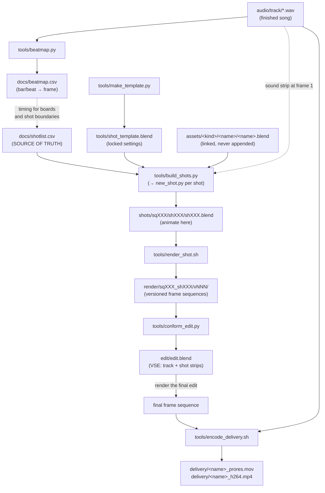

# Pipeline tools & production flow

What each script in `tools/` does, what it reads and writes, and how the whole
thing runs from a finished song to a delivered video. Conventions (naming,
statuses, linking rules) live in `pipeline.md`; this doc is the narrative.

## The big picture

The pipeline is built around one file: **`docs/shotlist.csv`**. Every shot in
the video is a row — its sequence/shot number, description, start/end frame in
the song's timeline, the assets it needs, and a status that walks from
`boarded` to `final`. Humans edit it; every tool reads it. Nothing downstream
invents structure: the tools just materialize what the shotlist says.

Two conventions make the math trivial everywhere:

- **Timeline frame 1 = song time 0, at 24 fps.** Shot frame ranges are
  *song-global* — shot `sq020_sh030` covering frames 481–528 is literally
  seconds 20–22 of the track. Any shot's playblast drops into the edit at its
  own frame numbers and is automatically in sync.
- **Settings live in one place.** Resolution, fps, color management, and
  output format are locked into `tools/shot_template.blend`. Shots inherit
  them at creation; the render script deliberately does not override them.



## The tools, one by one

### `tools/shotlib.py` — the shared brain (not run directly)

A stdlib-only Python module the other tools import. It owns the project's
path math and data contracts so they exist in exactly one place:

- parses and *validates* `docs/shotlist.csv` (3-digit ids, sane frame ranges,
  duration consistency, known statuses, no duplicate shots — bad rows fail
  loudly with `file:line` errors instead of corrupting downstream work)
- converts musical beats to frames (`beat_to_frame`)
- derives canonical paths (`shots/sq010/sh010/sh010.blend`,
  `render/sq010_sh010/`) and the next render version (`v001` → `v002`)
- finds the Blender binary (`$BLENDER` env var → `PATH` → the standard
  `/Applications` install)

It runs under both system Python and Blender's bundled Python, which is what
lets the same logic serve CLI tools and in-Blender scripts. Covered by the
test suite in `tools/tests/`.

### `tools/beatmap.py` — turn BPM into frame numbers

```sh
python3 tools/beatmap.py --bpm 92 --length 214
```

Run once, right after the track lands in `audio/track/`. Writes
`docs/beatmap.csv`: every beat of the song as bar number, beat number,
seconds, and timeline frame. This is the timing reference for everything —
when writing the shotlist you pick shot boundaries off this table so cuts
land on beats, and while animating you can check exactly which frame the
downbeat of bar 17 hits.

### `tools/make_template.py` — (re)build the shot template

```sh
"$BLENDER" --background --factory-startup --python-exit-code 1 \
    --python tools/make_template.py
```

Generates `tools/shot_template.blend`: an empty stage with a camera, the
`cam`/`chars`/`env`/`fx` collection layout, and the locked project settings —
1920×1080, 24 fps, EEVEE, AgX view transform, PNG 16-bit output, audio-synced
playback. Already generated and committed; you only rerun this if the project
settings themselves change (e.g. look-dev decides to link the clay material
library into it). Changing the template changes every shot created *after*
that point — existing shots keep their settings.

### `tools/new_shot.py` — stamp one shot file

```sh
"$BLENDER" --background tools/shot_template.blend --python-exit-code 1 \
    --python tools/new_shot.py -- --sq 010 --sh 010
```

Runs *inside* Blender with the template open. Looks up the shot's row in the
shotlist and saves `shots/sq010/sh010/sh010.blend` with:

- the scene named `sq010_sh010` and the frame range set to the row's
  song-global start/end frames
- the track from `audio/track/` as a sound strip at frame 1 (so scrubbing and
  playblasts are in sync; warns and continues if no track yet)
- every entry in the row's `assets` column **linked** (never appended) as a
  collection — `chars/redwood` links the `redwood` collection from
  `assets/chars/redwood/redwood.blend`; missing assets warn and skip

Refuses to overwrite an existing shot file unless `--force` is passed. You
rarely run this directly — `build_shots.py` calls it for you.

### `tools/build_shots.py` — materialize the whole shotlist

```sh
python3 tools/build_shots.py --dry-run   # preview what would be created
python3 tools/build_shots.py             # create every missing shot
```

The batch driver. Reads the shotlist, skips shots whose `.blend` already
exists, and runs `new_shot.py` once per missing shot. Run it after
storyboarding fills the shotlist, and again any time new rows are added —
it only ever creates what's missing. `--force` rebuilds existing shots from
the empty template; because that **overwrites animation work**, it lists the
affected shots and requires you to type `yes` before touching anything.

### `tools/env.sh` — shared shell plumbing (not run directly)

Sourced by the shell scripts. Resolves the project root and the Blender
binary (honoring `$BLENDER`) and fails with a clear message if Blender isn't
found, so the scripts that depend on it don't each reinvent discovery.

### `tools/render_shot.sh` — render one shot, versioned

```sh
tools/render_shot.sh 010 010          # → render/sq010_sh010/v001/
tools/render_shot.sh 010 010          # → v002 (auto-increments, v001 kept)
tools/render_shot.sh 010 010 v002     # explicit version = resume/re-render INTO v002
```

Headless-renders a shot as an image sequence. The frame range is read from
the shot's `docs/shotlist.csv` row *at render time* — the shotlist governs at
both ends of the pipeline, so retiming a row re-renders correctly without
recreating the shot file (the blend's stored range only drives in-UI
scrubbing and playblasts). Every run gets a fresh `vNNN` directory by
default, so old renders are never lost — you can
always A/B against the previous version. Passing an explicit version is the
crash-resume path: it re-renders into that directory (overwriting those
frames). Format and resolution come from the shot file's own settings (locked
by the template — PNG by default, switch a specific shot to EXR for
comp-heavy work and the script honors it). Frame sequences rather than movie
files because a crashed render resumes instead of starting over.

### `tools/conform_edit.py` — build/rebuild the edit from what's rendered

```sh
"$BLENDER" --background --factory-startup --python-exit-code 1 \
    --python tools/conform_edit.py            # first build
# add `-- --force` to rebuild (DESTROYS manual edit work — it's a full regen)
```

Creates `edit/edit.blend`: the track as the spine on channel 1 (the scene's
frame range is derived from the actual audio length), and every shot that has
rendered frames as an image strip on channel 2, placed at its song-global
start frame, always using the shot's *latest* `vNNN`. Because frames are
song-global, placement is mechanical — no eyeballing.

Two things to know: it's a **from-scratch regen**, so once you start hand-
cutting (cutaways on higher channels, trims, transitions) stop conforming and
maintain the edit manually — the `--force` guard exists to protect exactly
that work. And the edit scene deliberately uses the **Standard** view
transform: shot renders already have AgX baked in, and applying AgX again in
the edit visibly washes out every strip (verified: double-transformed frames
measure 25 dB PSNR against source vs. 102 dB when passed through untouched).

### `tools/encode_delivery.sh` — final masters

```sh
tools/encode_delivery.sh <frames_dir> <audio_file> <name>
```

The last step. Takes the final edit's rendered frame sequence plus the track
and produces two files in `delivery/`: a ProRes 422 HQ master
(`<name>_prores.mov`, archival/grading quality) and an H.264
(`<name>_h264.mp4`, CRF 18 + AAC 320k + faststart — upload-ready for
YouTube/Vimeo). Needs `ffmpeg` (installed via Homebrew).

## The flow, phase by phase

1. **Ideation / writing** — no tools yet. Notes in `docs/ideation/`, refs in
   `refs/`, treatment in `docs/treatment/`. Drop the track into
   `audio/track/` and run **`beatmap.py`**. Draft `docs/shotlist.csv` with
   shot boundaries picked off the beat map.
2. **Storyboards & animatic** — draw Grease Pencil boards (Storypencil) cut
   against the real track; the animatic locks each shot's true duration,
   which flows back into the shotlist. Statuses become `boarded`.
3. **Assets** — build characters/props/environments in `assets/`, one blend
   per asset, each exposing a root collection named after itself. Fill in
   each shot row's `assets` column.
4. **Shot creation** — **`build_shots.py`**. Fifty shot files appear, each
   already at the right frame range, with synced audio and linked assets.
5. **Animation** — open a shot, animate. Viewport playblasts go into
   `shots/.../playblast/` and replace animatic panels in `edit/edit.blend`,
   so the full video stays watchable while it's half-made. Statuses:
   `blocked` → `animated`.
6. **Rendering / comp** — **`render_shot.sh`** per shot (overnight batches:
   it's a loop in the shell away). Per-shot compositor tweaks re-render into
   the next version. Statuses: `rendered` → `comped`.
7. **Edit** — in `edit/edit.blend` (VSE), swap playblast strips for rendered
   `vNNN` sequences. Same cut from animatic to final; strips just upgrade.
8. **Delivery** — render the finished edit to a frame sequence, then
   **`encode_delivery.sh`** for the ProRes master and the upload encode.

The status column across all rows *is* the production dashboard: `grep -c
final docs/shotlist.csv` tells you how done the video is.
